### Hi there 👋

# Why I Build

# Projects

## APM Map

> A web application that provides students and early-career professionals over 150 resources and a network of mentors to help them break into product management. Check out the live site here.

  
  
 I'm helping build APM Map in hopes to simplify and humanize the recruiting process — sharing the tools we all need and creating a supportive community to bring our best selves to that interview.
  
  **Repository**: [jf2978/apm-map](https://github.com/jf2978/apm-map)  
  

  

  

## A Chain of Blocks

> A wanna-be blockchain built in Java.

  
  
 With my growing interest in the cryptocurrency space and the bitcoin protocol, I decided to take it upon myself to understand the inner workings of a blockchain. Using tutorials scavenged on the internets, my academic knowledge of cryptography, and the Bitcoin Whitepaper itself, I was able to build a simplified local blockchain that utilizes the proof-of-work (PoW) system.
 
  **Repository**: [jf2978/java-blockchain](https://github.com/jf2978/java-blockchain)  
  
  

    
  

## Java Netcat

> stuff about netcat goes here

  
  
 Some more stuff about why I built this goes here
 
  **Repository**: [jf2978/java-netcat](https://github.com/jf2978/Java-Netcat)  
  
  
  

## Flappy Bird: CU GameDev Edition

> Stuff about flappy bird goes here ...

  
  
 Once upon a time, I was a hardcore gamer. My budding interest in Computer Science naturally led me down the path of learning Unity 3D, designing simple games, and eventually trying to teach others to do the same.
 
  **Repository**: [jf2978/flappy-bird-clone](https://github.com/jf2978/java-blockchain)  
  
  
  

