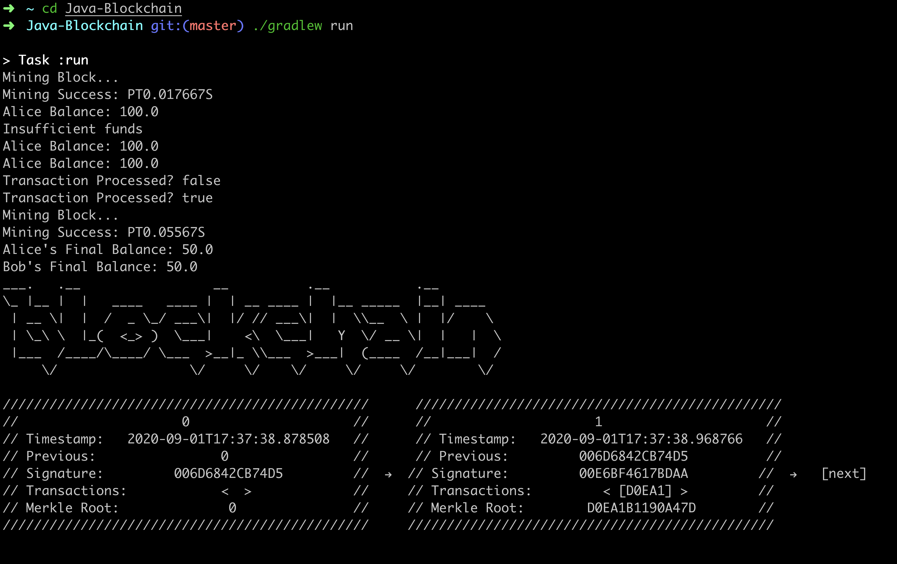
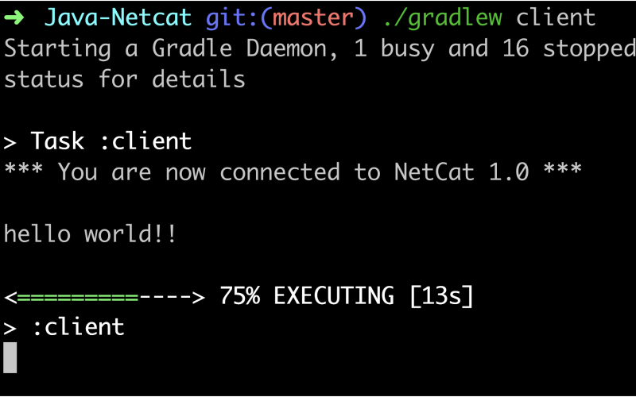

### Hey 👋🏼

I'm Jeff — software engineer @ [Mailchimp](https://mailchimp.com/andco/), co-creator of [APM Map](https://apmmap.co) and writer @ [Second Gen](https://secondgen.substack.com/welcome).

# Projects

## APM Map
###### 2020

> A web application that provides students and early-career professionals over 180 resources and a network of mentors to help them break into product management. Check out the live site [here](https://apmmap.co).

  
  
  **Repository**: [jf2978/apm-map](https://github.com/jf2978/apm-map)  
  
  

    
  

  

## A Chain of Blocks
###### 2018

> Using tutorials scavenged on the internet, my working knowledge of cryptography, and the Bitcoin whitepaper, I was able to build a wanna-be blockchain that utilizes the proof-of-work (PoW) system.

  
 
  **Repository**: [jf2978/java-blockchain](https://github.com/jf2978/java-blockchain)  
  
  

    
  

## Java Netcat
###### 2018

> A command-line application that emulates the well-known networking tool, [netcat](https://en.wikipedia.org/wiki/Netcat). I dove into the project with more questions than answers, but learned a [ton](https://github.com/jf2978/Java-Netcat/blob/master/sockets.notes).

  
   
  **Repository**: [jf2978/java-netcat](https://github.com/jf2978/Java-Netcat)  
    
   

    
  

  

## Flappy Bird: CU GameDev Edition
###### 2017

> Once upon a time, I was a hardcore gamer. That, alongside my budding interest in Computer Science, naturally led me down the path of learning Unity 3D, designing simple games, and eventually trying to teach others to do the same.

  
 
  **Repository**: [jf2978/flappy-bird-clone](https://github.com/jf2978/flappy-bird-clone)  
  

    
  

  
  [Play the game here](https://jf2978.itch.io/flappy-bird)!
  

