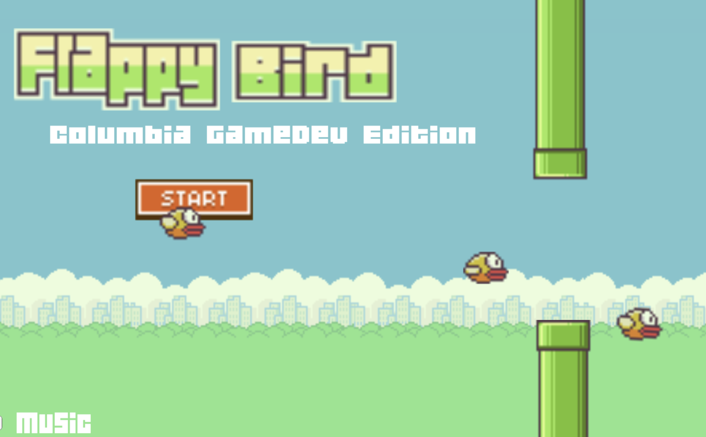

### Hey 👋🏼

My name is Jeff. I'm an experienced full-stack engineer and generally an intellectually curious person. I've started dabbling in crypto in 2018, worked as an engineer at [Mailchimp](https://mailchimp.com/), have [written](https://www.secondgen.co/) a bit about personal finance & wealth, and am now [tinkering in web3](https://twitter.com/second_jeff) -- whether that's as a builder, researcher, writer or all of the above.

# Projects

Since you're on my GitHub profile, I'm guessing you mainly want to see what I've built so far. Here are the highlights:

### APM Map 🗺️
###### 2020

> A web application that provides students and early-career professionals over 180 resources and a network of mentors to help them break into product management. Check out the live site [here](https://apmmap.co).

  
  
  **Repository**: [apm-map/apm-map](https://github.com/apm-map/apm-map)  
  
  

    
  

  

### Java Netcat 💬
###### 2018

> A command-line application that emulates the well-known networking tool, [netcat](https://en.wikipedia.org/wiki/Netcat). I dove into the project with more questions than answers, but learned a [ton](https://github.com/jf2978/Java-Netcat/blob/master/sockets.notes).

  
   
  **Repository**: [jf2978/java-netcat](https://github.com/jf2978/Java-Netcat)  
 
###### "Server"
    

  

###### "Client"
    

  

### Flappy Bird: CU GameDev Edition 🐤
###### 2017

> Once upon a time, I was a hardcore gamer. That, alongside my budding interest in Computer Science, naturally led me down the path of learning Unity 3D, designing simple games, and eventually trying to teach others to do the same.

  
 
  **Repository**: [jf2978/flappy-bird-clone](https://github.com/jf2978/flappy-bird-clone)  
  

    
  

  
  [Play the game here](https://jf2978.itch.io/flappy-bird)!
  

